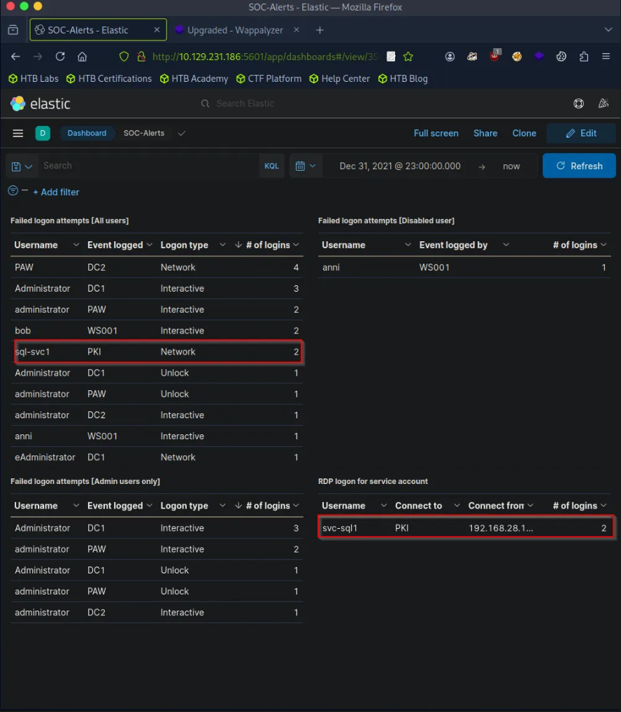
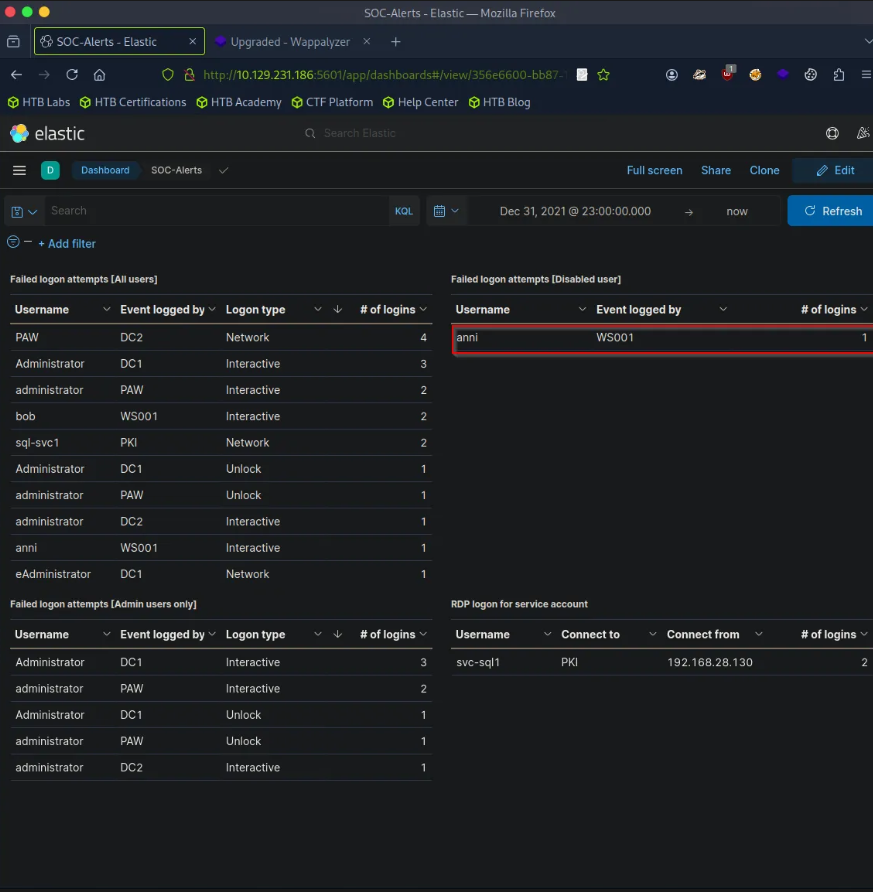
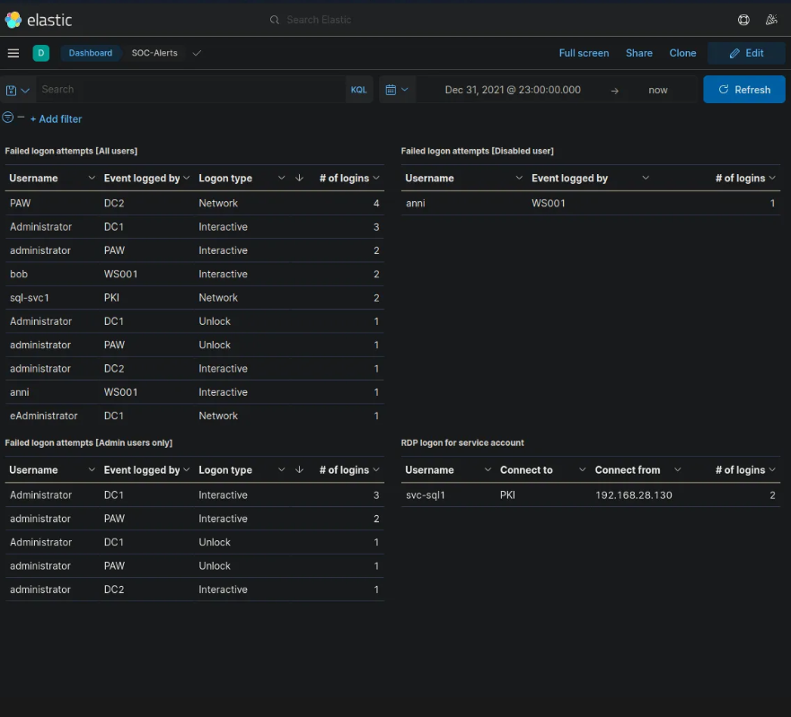
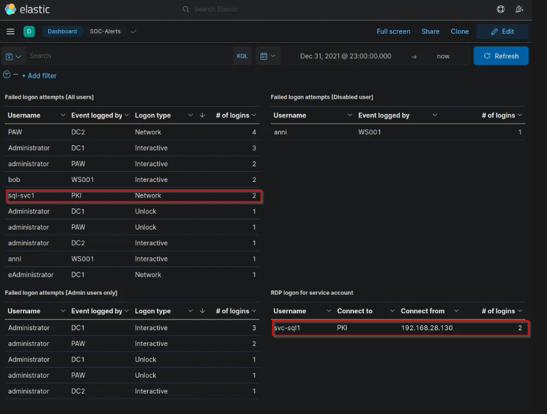
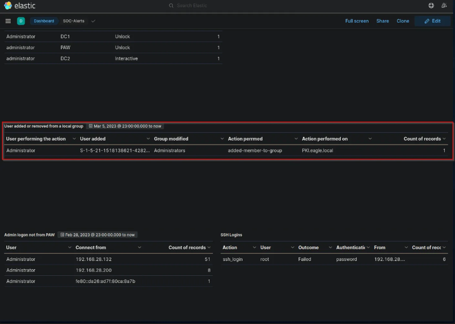
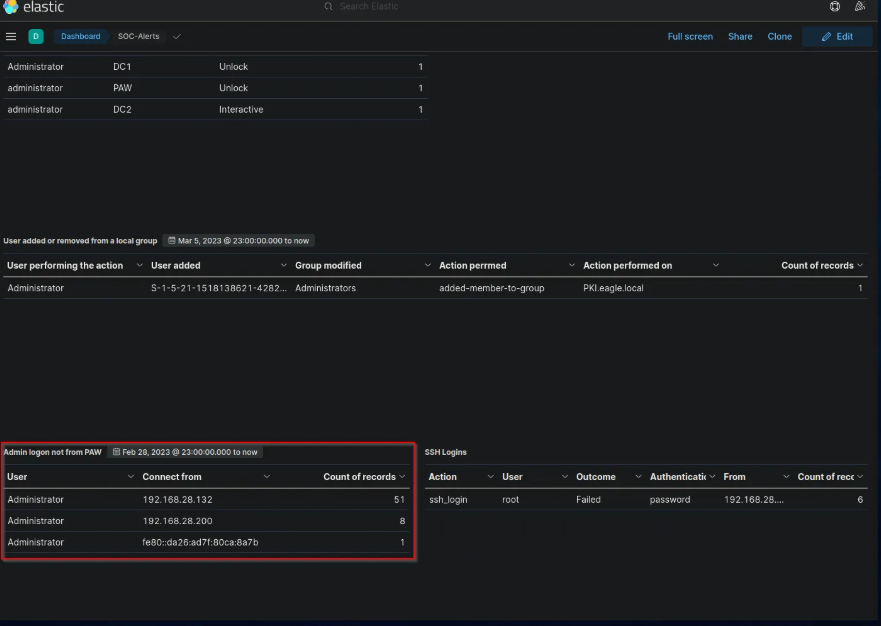
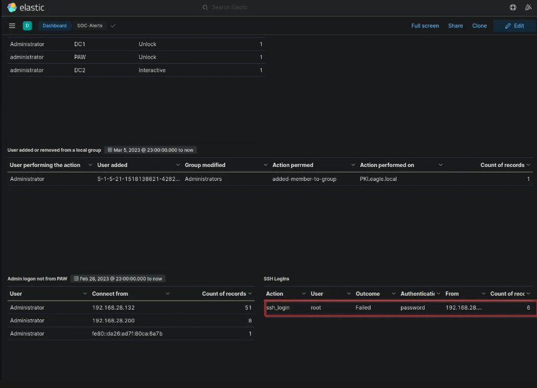

# SOC-Alerts Dashboard Review & Analysis

## Organizational Context

- Cloud-only infrastructure (legacy DMZ decommissioned)
- Admin access limited to 4 IT Operations personnel
- PAW (Privileged Admin Workstation) required for admin activities
- Strict naming conventions and hardening policies (CIS baseline)

---

## Incident Observations & Recommendations

### 1. **Failed Logon Attempts (All Users)**

- **Suspicious Behavior:** `sql-svc1` failed 2 logins and then succeeded twice via RDP on PKI.
- **Risk:** Service accounts are not expected to perform interactive logins.
- **Action:** 🟡 *Consult with IT Operations*

### 2. **Failed Logon Attempts (Disabled Users)**

- **Suspicious Behavior:** Disabled user `Anni` attempted login from WS001.
- **Risk:** Potential reuse of old credentials or attacker persistence technique.
- **Action:** 🔴 *Escalate to Tier 2/3 Analyst*

### 3. **Failed Logon Attempts (Admin Users Only)**

- **Suspicious Behavior:** Multiple failed logins using `Administrator` and `administrator` across systems.
- **Risk:** Brute force activity, possibly testing case sensitivity.
- **Action:** 🔴 *Escalate to Tier 2/3 Analyst*

### 4. **RDP Logon for Service Account**

- **Suspicious Behavior:** `svc-sql1` successfully connected to PKI over RDP.
- **Risk:** Lateral movement or misuse of service accounts.
- **Action:** 🔴 *Escalate to Tier 2/3 Analyst*

### 5. **User Added to Local Group**

- **Suspicious Behavior:** Unknown SID added to Administrators group.
- **Risk:** Privilege escalation. SID should be resolved and verified.
- **Action:** 🟡 *Consult with IT Operations*

### 6. **Admin Logon Not From PAW**

- **Suspicious Behavior:** Admin logins seen outside PAW endpoints.
- **Risk:** Policy violation and obfuscation risk for attackers.
- **Action:** 🟡 *Consult with IT Operations*

### 7. **SSH Logins**

- **Suspicious Behavior:** Multiple root login attempts via SSH.
- **Risk:** Root access should be disabled; high-risk brute force pattern.
- **Action:** 🔴 *Escalate to Tier 2/3 Analyst*

---
## Summary Conclusion

Multiple indicators point to a coordinated attempt involving credential abuse, lateral movement, and policy violation. This activity warrants immediate investigation and containment.
